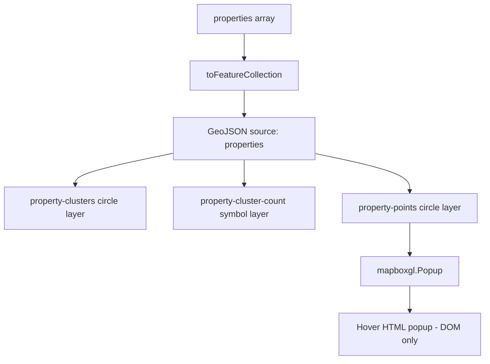

## Design decisions

Address each of the four ambiguous areas (one to three sentences each):

1. **Map provider** — which provider you chose and the trade-off versus the alternatives.
The map provider I chose is Mapbox over Leaflet and Google because it offers built-in clustering for points, scaleable for real-world application and utilizes WebGL rendering rather than DOM rendering in Leaflet. Additionally, I found Mapbox's map UI more appealing than Leaflet/OpenStreetMaps UI since Mapbox's baselayer includes point-of-interests and streets which are important when factoring a place to rent. These factors can improve user experience and help renters determine what's around the location they're wanting to move to.  

2. **Performance at density** — how you keep the map smooth with all markers visible (clustering, viewport rendering, etc.) and what you observed.

I used WebGL layering to keep my map smooth with all the markers visible along with the viewport rendering markers within the box and loads/ refetches after each pan/zoom. To avoid overloading the backend I have added a debounce of 500ms on the browser page. When the user is zoomed out and the markers are within a certain radius, the markers become clustered creating a larger circle displaying the number of properties within the cluster. Additionally, I have added pop ups to the nodes through a single shared mapboxgl.Popup rather than one DOM node per listing.

3. **Geospatial querying** — how the server answers a viewport query without scanning the table, and how you use the geohash index.
Once the map loads or the user has finished moving/zooming on the map, MapPanel.tsx sends the visible boundary box coordinates to the parent page, which debounces them and requests GET. These coordinates are parsed through the router and calls the queryByBoundingBox() which checks the overlapping prefixes and the GSI within the box instead of scanning the entire table. After that has been called the filterProperties() is called on the list of properties and check if it is within the bounding box.

4. **Filtering model** — the dimensions you support, how filters compose, and the empty/reset behaviour.
The dimensions I have for filtering are min rent, max rent, bedrooms, property type, square footage and city. When filtered it shows only the property cards within view and return true. If no properties are available, the listings show 'No listings match your search', and to reset their filters there is a reset button that will repopulate the listings in view and change all constraints back to 'Any'. The listings must match every active constraint, which are applied on the server-side after the viewport query so that the map and filters are always in sync. 

## What I'd add with more time
If I had more time I would add more details with the hover popups. This would adding a clean interactive UI where the user can scroll through additional pictures through an image carousel. I would also add the clicking to open popups, I currently only have it under hover. 
Search function based on titles for filters. Lastly if I had more time I would have a more interactive filterbar which includes more animated design when click or selecting constraints. 

### Describe the highest-value improvements you would make next.
The highest value improvement I would make next is tuning the debounce along with the addition of a loading state for the map when refetching the new results in the new boundingbox query or new filter changes. Currently, after the first load, the list and map show previous results until the new query returns which can feel unresponsive although the map panning feels smooth.